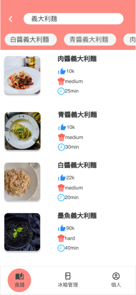

# Cooking Voice Assistant

## Project Overview

A cooking assistant app that uses Azure Cognitive Services for intent recognition and Speech-to-Text (STT). Users can control the app entirely by voice, solving the inconvenience of reading recipes while cooking.

## Features

- **Recipe Search:**  
  _“Find recipes with pork and cabbage.”_
- **Step Navigation:**  
  _“Previous step.”_, _“Next step.”_, _“Go to step 4.”_
- **Step Reading:**  
  _“Read out step 3.”_
- **Ingredient Check:**  
  _“Do I have milk in the fridge?”_
- **Ingredient Management:**  
  _“Add milk to the fridge.”_

## Technology Stack

- **JavaScript**, **React**, **Node.js**
- **Firebase** (real-time database)
- **Azure Cognitive Services** (Intent Recognition & Speech-to-Text)
- **Git** (version control)

## Resources

- [Demo Video](https://youtu.be/6bVTywDfLlc)
- [Presentation Video](https://youtu.be/i9l10Vul5vE)
- [Presentation Slides Part 1](https://drive.google.com/file/d/1NM7MdJss_6PMXIWSSzM4B2vlLMQ6Hy7g/view?usp=share_link)
- [Presentation Slides Part 2](https://drive.google.com/file/d/1n93ty5UqSlbg4VklHclj0n7o8kokScFf/view?usp=share_link)

## Screenshots

  
